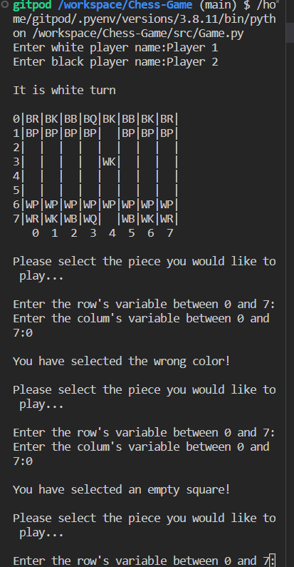
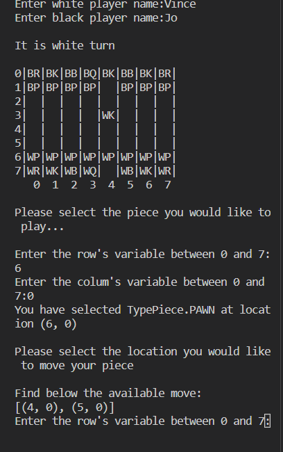
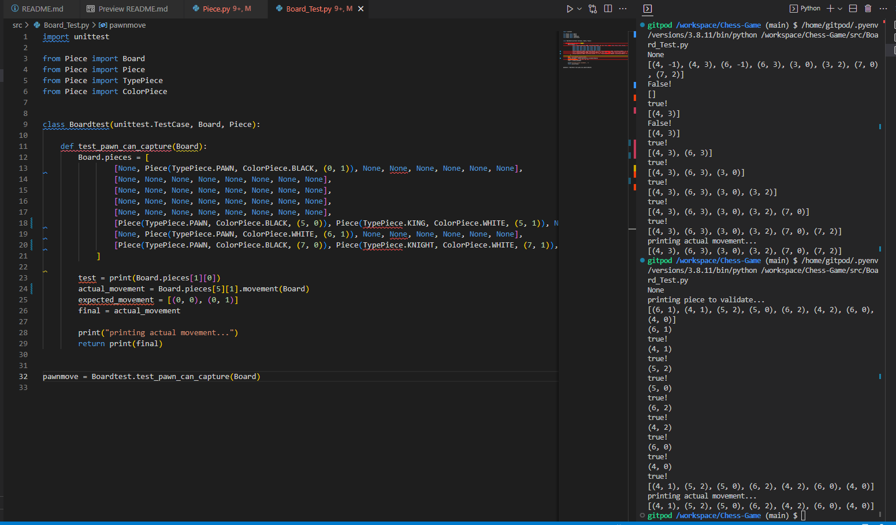
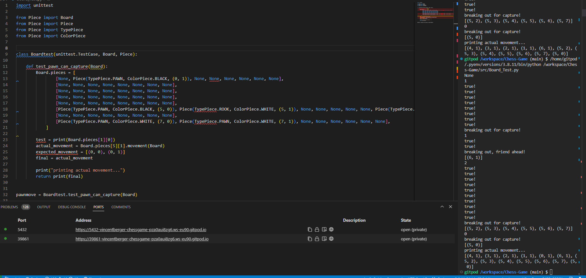

# Chess Game

This is a simple chess game coded with python. The board is printed on the console and players interact in the console to move their pieces.

The live link can be found here: [https://chess-game-vincent.herokuapp.com/](https://chess-project-3-1d51e65ecec6.herokuapp.com/)

## Features

The chess game is printed in the console everytime a piece is moved. Text is printed to tell the user which turn it is and what they need to enter to be able to move their pieces. The board is in a grid from 0 to 7 where the users select coordinate of the piece he wants to play and then select the location he wants to move this piece. Text is printed when a player is check and the game stop when a player is checkmate.

### Existing Features

__Enter Username__

- At the beginning of the game, the users will enter their username. This is a simple input asking for the white and black player name.

__Print board__

- Everytime a player is starting his turn, the board will be printed into the console to help the user select his piece and move location

__Select piece and select move location__

- After the board is printed, the console ask the row and column of the piece the player would like to move. If the player select an empty location or the other player piece, it send back an error message and ask again the player to enter the row and column.

- Once the piece is chosen, it prints in the console the available moves for that specific piece. The console then ask for the row and column of the next location of the piece. If the row and column enter by the player is not in the available moves of the piece, it sends a message error and ask again the row and column of the move the player would like to undertake.

- If there are no moves available for that piece, it send back an error message and ask to choose a valid piece.

__Move piece__

- Once the piece and the new location is choosen, the piece is move to the new location on the board.

__Check or Checkmate__

- At each turn, a code is checking if the current player is in check or checkmate. There are 3 conditions for the player to be checkmate:
    - No available move for his king without being capture by his opponent.
    - Not possible to capture the attacking piece that put the king in check or able to capture but expose the king to another attacking piece.
    - Not possible to place a friendly piece to block the attacking piece or able to block the block the atacking piece but expose the king to another attacking piece.

__Prevent wrong move when check__

- This last feature ensure the player not to play a move that will put his king into a check position and therefore conclude the game.

### Features left to implement

- A draw function could be implemented. For this version, we take into consideration that player are experienced enough to understand when a draw is confirmed.

- Python offers libraries for a better visual of the board. As this project is to learn the basic coding of python, this visual board was not implemented.

## Testing

Testing has been undertaken during the construction of the code. A specific file called board_test was use to test separately each of the function.

See below example of tests that have been undertaken using the board_test file and prints inside the codes

### Validator Testing

- Finaly the code has been validated through the PEP8 Python Validator. The only result is ""Line too long" which is acceptable in this kind of code.

### Unfixed Bugs

 - All bugs have been fixed.

## Deployment

- The project was deployed using the app Heroku. The steps explained in the Code Institue course have been followed:
    - Complete the project and push it to Git Hub
    - Create a Heroku account
    - Create a app on Heroku account
    - Link Git Hub to Heroku
    - Search for the repository and add link it to Heroku
    - Add the buildbacks Python and Node.JS
    - Deploy the project

The live link can be found here: [https://chess-game-vincent.herokuapp.com/](https://chess-project-3-1d51e65ecec6.herokuapp.com/)

- Note that no creds are required for this project. Name of the python file has been changed from game to run to accomodate the Heroku requirement and all python files move to the main folder.

## Credits

- The coding itself was developed using the tool of the course. For details how to run specific functions, the website Stack Overflow was a great help. Please note that no code has been copy/paste from any website. The website was only a tool to understand the mechanic of the code.

### Content

- Non-applicable

### Media

- Non-applicable.

